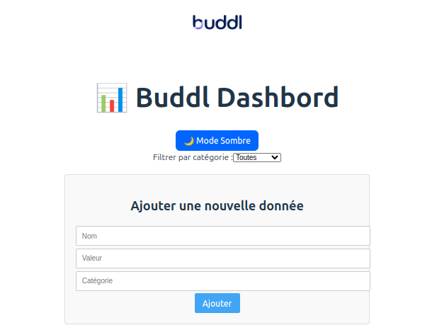
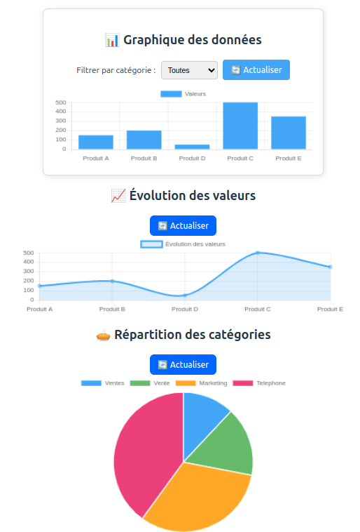

# 📊 Buddl Dashboard

Buddl Dashboard est une application web interactive permettant d'afficher et de filtrer des données sous forme de graphiques dynamiques.  
Elle est développée avec **Vue.js** (frontend), **Node.js / Express** (backend) et **MongoDB** (base de données).

---

## 🚀 Installation et Exécution

### 1️⃣ Prérequis
Avant de commencer, assurez-vous d'avoir installé :
- **Node.js** (v16 ou plus) : [Télécharger Node.js](https://nodejs.org/)
- **MongoDB** (local ou MongoDB Atlas) : [Installation MongoDB](https://www.mongodb.com/try/download/community)
- **Git** (optionnel, pour cloner le repo) : [Télécharger Git](https://git-scm.com/)

### 2️⃣ Cloner le projet
```sh
git clone https://github.com/ton-utilisateur/buddl-dashboard.git
cd buddl-dashboard
```

### 3️⃣ Installer les dépendances
#### ➞ **Backend (Node.js & Express)**
```sh
cd backend
npm install
```

#### ➞ **Frontend (Vue.js)**
```sh
cd ../frontend
npm install
```

### 4️⃣ Lancer l'application
#### ➞ **Démarrer MongoDB (si installé localement)**
```sh
sudo systemctl start mongod  # Linux (Ubuntu)
brew services start mongodb-community  # macOS (Homebrew)
```
> **Ou** utilisez MongoDB Atlas en configurant la variable d'environnement `MONGO_URI` dans `.env`.

#### ➞ **Lancer le backend**
```sh
cd backend
npm run dev
```
Le serveur tourne sur **`http://localhost:5000`** 🚀

#### ➞ **Lancer le frontend**
```sh
cd frontend
npm run dev
```
L'application est accessible sur **[http://localhost:5173](http://localhost:5173)** 🎉

---

## 📸 Capture d'écran



---

## 🔧 Fonctionnalités
✅ Ajout de nouvelles données via le formulaire  
✅ Affichage de graphiques interactifs (barres, lignes, camembert)  
✅ Filtrage dynamique des données  
✅ Mode sombre activable/désactivable  
✅ Connexion à MongoDB pour stocker les données  

---

## 🔧 Configuration des variables d'environnement (`.env`)
Dans **le dossier backend**, crée un fichier `.env` et ajoute :
```env
PORT=5000
MONGO_URI=mongodb://localhost:27017/buddl
```
Si tu utilises **MongoDB Atlas**, remplace `MONGO_URI` par ton URI MongoDB.

---

## 📂 Structure du projet
```
buddl-project/
│── backend/              # Serveur Node.js avec Express
│   ├── models/           # Modèles Mongoose pour MongoDB
│   ├── routes/           # Routes API Express
│   ├── app.js         # Point d'entrée du serveur
│   ├── .env              # Variables d'environnement (MongoDB, port, etc.)
│   ├── package.json      # Dépendances du backend
│── frontend/ 
|   ├── frontend-app       # Application Vue.js
│       ├── src/
│       │   ├── components/   # Composants Vue (Charts, Form, etc.)
│       │   ├── App.vue       # Composant principal
│       │   ├── main.js       # Point d’entrée de Vue
│       ├── public/           # Assets statiques
│       ├── package.json      # Dépendances du frontend
|   ├── public/ 
│   ├── src/
│── .gitignore            # Fichiers à ignorer par Git
│── README.md             # Documentation du projet
```

---

## 🤝 Contribution
Les contributions sont les bienvenues ! Pour contribuer :
1. **Fork** le projet 🍝
2. Crée une nouvelle branche (`git checkout -b feature-mafonctionnalite`)
3. Fais tes modifications et commit (`git commit -m "Ajout d'une nouvelle fonctionnalité"`)
4. Pousse tes modifications (`git push origin feature-mafonctionnalite`)
5. Ouvre une **Pull Request** 📬

---

## 💬 Contact
💎 Email : [stephane.kouadio.1811@gmail.com](mailto:stephane.kouadio.1811@gmail.com)  
💼 LinkedIn : [linkedin.com/in/kouadio-konan-junior-aimé-stephane](https://www.linkedin.com/in/kouadio-konan-junior-aim%C3%A9-st%C3%A9phane/)  
🌐 Site web : [https://www.buddl.io/](https://www.buddl.io/)

---

🚀 **Merci d’utiliser Buddl Dashboard !** 🎉  
**N’hésite pas à laisser une étoile ⭐ sur le repo si ce projet t’a aidé !**

